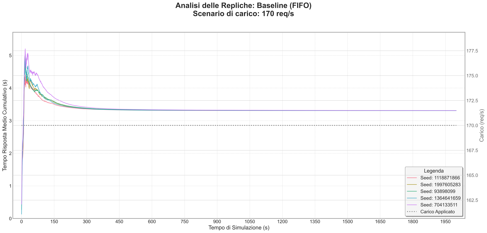
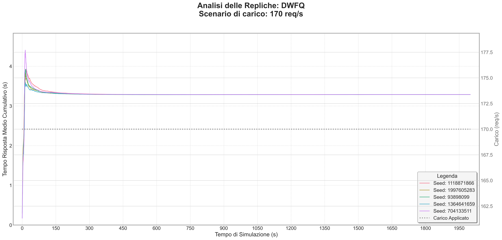

# Kubernetes HPA Simulation

A discrete-event simulation of an e-commerce workload, built with Python and SimPy to study how autoscaling and request scheduling affect response times, queue lengths and timeouts.

The model represents worker nodes, pods and a queue-based Horizontal Pod Autoscaler. It compares FIFO, strict priorities and Weighted Fair Queuing (WFQ), including a dynamic variant with load shedding. All experiments run locally; a Kubernetes cluster is not required.

## What the model includes

- Three worker nodes, each with its own queue and a configurable number of pods.
- Five request types: navigation, login, add-to-cart, checkout and analytics.
- Service-time distributions and request-specific timeouts.
- Autoscaling limits, polling intervals and cooldown periods.
- Lehmer-generated replication seeds and separate NumPy random streams for arrivals, request selection and service times.
- Transient traces, steady-state analysis, batch means and confidence intervals.

The autoscaler is a simplified model implemented in [src/controller/hpa.py](src/controller/hpa.py). Results describe this model and its assumptions; they do not measure a deployed Kubernetes cluster.

## Setup

Use Python 3.10 or newer. Run the commands below from the repository root.

```bash
python3 -m venv .venv
source .venv/bin/activate
python -m pip install -r requirements.txt
```

## Run an experiment

Start with the finite-horizon comparison:

```bash
python -m src.main_wfq
```

This runs five replications of FIFO, strict priorities and WFQ. Each replication lasts 900 simulated seconds, with a load peak from 200 to 500 seconds. Charts are saved under `output/WFQ_analysis/`.

Other entry points:

| Command | Experiment | Output |
| --- | --- | --- |
| `python -m src.main` | FIFO and WFQ at 85 requests/s, 80,000 simulated seconds, with steady-state analysis | `plots/steady_state/` |
| `python -m src.main_blackfriday` | 50 replications of the Black Friday model, 3,000 simulated seconds each | `output/black_friday_analysis/` |
| `python -m transient_analysis.run_transient_analysis` | Five replications at 170 requests/s, 10,000 simulated seconds each | `output/transient_analysis/` |

For a machine without a graphical session, select Matplotlib's non-interactive backend:

```bash
MPLBACKEND=Agg python -m src.main_wfq
```

Simulation time is model time, not wall-clock execution time. Long runs collect individual request traces and can use substantial memory.

## Configuration and reference plots

System parameters, traffic mix, service times, scheduling weights and the initial random seed are defined in [src/config.py](src/config.py). Experiment-specific arrival rates, durations and replication counts are defined in each entry point.

The current Black Friday script sets all four load levels to 170 requests/s. To run a changing daily profile, adjust `CARICO_1` through `CARICO_4` in `src/main_blackfriday.py` before launching it.

Reference plots from earlier experiments are preserved in [src/output/black_friday_analysis/aggregated_traces](src/output/black_friday_analysis/aggregated_traces). They are historical outputs, not results regenerated on every checkout. New results in the root `output/` and `plots/` directories are ignored by Git.





## Code layout

| Directory | Responsibility |
| --- | --- |
| `src/simulation/` | Event generation, request handling and simulation variants |
| `src/controller/` | Queue-based autoscaling |
| `src/model/` and `src/service/` | Requests, worker nodes and service-time sampling |
| `src/utils/` | Random streams, metrics, online statistics and WFQ queues |
| `src/analysis/` | Charts and reports |
| `src/steady_state_analysis/` | Warm-up handling and steady-state statistics |
| `src/verification/` | Analytical checks and diagnostic experiments |

The verification scripts are separate academic experiments with their own configurations. They are not an automated test suite for every scheduling policy.

Run the regression checks for batch analysis and report generation with:

```bash
MPLBACKEND=Agg python -m unittest discover -s tests
```

If batch analysis cannot find enough sufficiently decorrelated batches, the report marks the confidence interval as unavailable and skips the cumulative batch charts.
